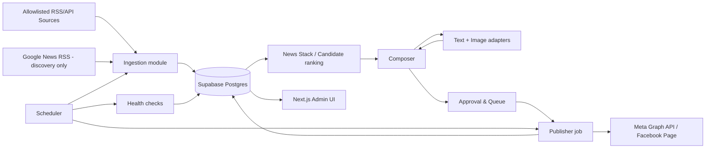
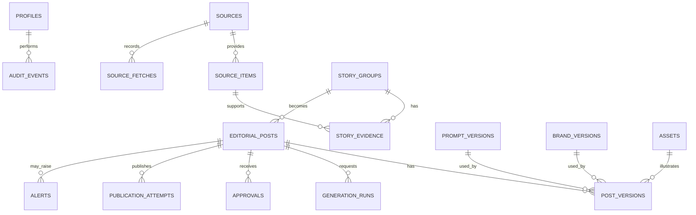

# Technical Design: Sports News Admin

## 1. Document control

| Field | Value |
|---|---|
| Version | 0.1 |
| Date | 2026-09-22 |
| Status | Draft for approval |
| Scope | MVP technical design |
| Companion product document | [SPORTS_NEWS_ADMIN_PRD.md](./SPORTS_NEWS_ADMIN_PRD.md) |
| Canonical domain language | [CONTEXT.md](../CONTEXT.md) |

This document turns the confirmed product requirements into an implementation design. Product policy remains authoritative in the PRD. Technical choices marked **proposed default** are safe starting points, not production constraints until the deployment/provider choices are confirmed.

## 2. Architecture decisions

### 2.1 Chosen MVP shape

Build one Next.js application that owns the authenticated admin UI, server-side command handlers, read queries, and integration adapters. Supabase supplies Postgres, Auth, and Storage. A scheduler invokes protected server endpoints for ingestion, preparation, publishing, retries, and connection checks.

This deliberately avoids microservices in the MVP. The core operations are small in volume (3–5 posts/day and scheduled polling), and a modular monolith makes auditability and transactional publishing simpler.

### 2.2 Logical architecture



### 2.3 Module boundaries

| Module | Owns | Must not own |
|---|---|---|
| Identity & access | Profile, role checks, session authorization | Provider secrets or editorial policy |
| Source registry | Source configuration, tier, fetch health | Generated captions or publication decisions |
| Ingestion | Fetch, normalize, store Source Items | Editorial approval or Facebook publishing |
| Story intelligence | Deduplication, grouping, ranking, candidate recommendation | Mutating original source evidence |
| Editorial | Prompt/brand versioning, draft generation, validation, approval | Direct scheduler timing |
| Publishing | Queue claims, idempotency, Meta adapter, retries, Publication records | Re-ranking stories or changing copy |
| Operations | Job runs, alerts, connection health, audit trail | Silent automatic decisions that bypass approval |

### 2.4 Time model

- Persist all instants as `timestamptz` in UTC.
- Store a business timezone setting fixed to `Asia/Bangkok` in MVP.
- Convert all displayed schedules and all slot validation in the application using this timezone.
- UI stores a user-entered local schedule as Bangkok wall-clock time and converts it to UTC once before persistence.
- Scheduler expressions must be configured for Bangkok semantics or converted to UTC by the scheduler provider; this requires verification during host selection.

## 3. Recommended application layout

```text
app/
  (auth)/login/
  (admin)/dashboard/
  (admin)/news-stack/
  (admin)/composer/[storyId]/
  (admin)/queue/
  (admin)/sources/
  (admin)/prompts/
  (admin)/brand/
  (admin)/history/
  (admin)/settings/integrations/
  api/jobs/{ingest-approved,ingest-discovery,refresh-candidates,publish-due,retry-publishes,check-health}/route.ts
modules/
  identity/
  sources/
  ingestion/
  stories/
  editorial/
  publishing/
  operations/
  shared/
lib/
  db/
  integrations/{rss,google-news,ai-text,ai-image,meta}/
  security/
supabase/
  migrations/
  seed/
```

**Rule:** a route handler/server action calls a module command or query; it does not directly embed integration-specific logic. Integration adapters return normalized results, so a provider can be replaced without changing editorial or publishing rules.

## 4. Domain and persistence model

### 4.1 Entity relationship overview



### 4.2 Enumerations

| Enum | Values |
|---|---|
| `source_type` | `rss`, `api`, `google_news_discovery`, `x_api` |
| `source_tier` | `tier_1_official`, `tier_2_established_media`, `tier_3_discovery` |
| `source_item_status` | `new`, `grouped`, `ignored` |
| `story_status` | `candidate`, `selected`, `dismissed`, `archived` |
| `post_status` | `drafting`, `pending_approval`, `needs_revision`, `approved`, `scheduled`, `publishing`, `published`, `needs_attention`, `removed` |
| `generation_kind` | `ranking`, `caption`, `image` |
| `generation_status` | `requested`, `succeeded`, `failed`, `quota_exceeded` |
| `publication_status` | `claimed`, `submitted`, `succeeded`, `retryable_failure`, `final_failure` |
| `alert_severity` | `info`, `warning`, `critical` |

### 4.3 Core tables

IDs are UUIDs. Tables have `created_at timestamptz not null default now()` and `updated_at` where they are mutable.

| Table | Required fields | Constraints and notes |
|---|---|---|
| `profiles` | `id` (matches `auth.users.id`), `email`, `role`, `active` | Role: `admin`, `editor`, `approver`. Initial seed creates one active admin. |
| `sources` | `name`, `source_type`, `tier`, `base_url`, `feed_url`, `enabled`, `config_json`, `last_success_at`, `last_failure_at` | `tier_3_discovery` only for discovery connectors. `feed_url` unique when non-null. No hard-delete while referenced. |
| `source_fetches` | `source_id`, `started_at`, `finished_at`, `status`, `http_status`, `items_found`, `error_code`, `safe_error_detail` | One operational record per fetch. Never store credentials or whole response bodies. |
| `source_items` | `source_id`, `external_id`, `canonical_url`, `title`, `excerpt`, `publisher_published_at`, `fetched_at`, `content_hash`, `status` | Unique on `(source_id, external_id)` when known and `(source_id, canonical_url)`. Raw full text is optional and must respect source terms. |
| `story_groups` | `category`, `status`, `dedupe_key`, `score`, `score_explanation`, `recommended_at`, `selected_at` | Unique `dedupe_key` only when the grouping algorithm is confident; preserve manual merge/split audit events. |
| `story_evidence` | `story_id`, `source_item_id`, `evidence_role`, `linked_by`, `linked_at` | `evidence_role`: `discovery`, `primary`, `supporting`. A publishable Story needs at least one `primary` item from Tier 1 or Tier 2. |
| `prompt_versions` | `kind`, `name`, `body`, `status`, `created_by`, `activated_at`, `supersedes_id` | `kind`: `base` or `preset`. Active records are immutable; base prompt rules are server-controlled. |
| `brand_versions` | `name`, `page_name`, `logo_asset_id`, `palette_json`, `font_config_json`, `caption_footer`, `status` | Snapshot not mutable after activation. |
| `assets` | `storage_path`, `mime_type`, `width`, `height`, `sha256`, `origin`, `generation_run_id` | Private storage until publication. `origin`: `ai_generated`, `uploaded`, `derived`. |
| `editorial_posts` | `story_id`, `status`, `current_version_id`, `scheduled_for`, `is_breaking`, `approved_at`, `approved_by`, `published_at` | One selected Story may initially have one active post; enforce uniqueness on active post/story in MVP. |
| `post_versions` | `post_id`, `version_number`, `headline`, `caption`, `why_it_matters`, `hashtags_json`, `primary_source_item_id`, `image_asset_id`, `base_prompt_version_id`, `preset_version_id`, `brand_version_id`, `instruction`, `created_by` | Immutable snapshot. A new version is created for factual/source/caption/image changes. |
| `generation_runs` | `post_id`, `kind`, `status`, `provider`, `model`, `input_fingerprint`, `output_asset_id`, `safe_output_summary`, `cost_json`, `attempt_number` | Never log raw provider keys or unnecessary sensitive request content. |
| `approvals` | `post_id`, `post_version_id`, `decision`, `decided_by`, `decided_at`, `note` | `decision`: `approved`, `returned`. Scheduling must reference an approval for the current version. |
| `publication_attempts` | `post_id`, `post_version_id`, `idempotency_key`, `status`, `attempt_number`, `claimed_at`, `submitted_at`, `provider_post_id`, `provider_post_url`, `safe_response`, `retry_after`, `finished_at` | Unique `idempotency_key`; unique successful `post_id`. |
| `alerts` | `entity_type`, `entity_id`, `kind`, `severity`, `message`, `status`, `raised_at`, `resolved_at`, `resolved_by` | In-app only in MVP. `status`: `open`, `acknowledged`, `resolved`. |
| `audit_events` | `actor_id`, `entity_type`, `entity_id`, `action`, `before_json`, `after_json`, `reason`, `occurred_at` | Append-only. Redact all secrets before writing. |
| `job_runs` | `job_name`, `idempotency_key`, `started_at`, `finished_at`, `status`, `counters_json`, `safe_error_detail` | Makes scheduled work observable and supports safe re-runs. |

### 4.4 Required indexes

```text
sources(enabled, source_type)
source_items(source_id, fetched_at DESC)
source_items(canonical_url)
story_groups(status, score DESC, created_at DESC)
story_evidence(story_id, evidence_role)
editorial_posts(status, scheduled_for)
publication_attempts(post_id, status, attempt_number)
alerts(status, severity, raised_at DESC)
audit_events(entity_type, entity_id, occurred_at DESC)
job_runs(job_name, started_at DESC)
```

### 4.5 Database invariants

1. A `post_version` cannot reference a source item that is not evidence for the post’s Story.
2. A Tier 3 item cannot be `primary_source_item_id`.
3. `editorial_posts.current_version_id` must belong to the same post.
4. A post can be `scheduled` only when its current version has a matching approved `approvals` record.
5. A successful `publication_attempt` makes the post `published` in the same transaction.
6. Audit events are insert-only for application roles; updates/deletes are denied.
7. A disabled source cannot create new source fetches or source items.

## 5. State machines and critical commands

### 5.1 Editorial Post state transitions

| From | Command | To | Preconditions |
|---|---|---|---|
| `drafting` | `saveDraft` | `pending_approval` | Current version contains caption, source credit, source URL, image, and valid content policy checks. |
| `pending_approval` / `needs_revision` | `approvePost` | `approved` | Current version valid; actor has approval permission; approval is recorded. |
| `pending_approval` / `approved` | `returnForRevision` | `needs_revision` | Reason is required. |
| `approved` | `schedulePost` | `scheduled` | Schedule is in future; current version still matches approval. |
| `scheduled` | `claimDuePost` | `publishing` | Due time reached; connection healthy; atomic claim succeeds. |
| `publishing` | `recordPublishSuccess` | `published` | Meta returns/has been reconciled to one provider post ID. |
| `publishing` | `recordRetryableFailure` | `scheduled` | Retry count remains within configured limit; retry time is set. |
| `publishing` | `recordFinalFailure` | `needs_attention` | Retry limit reached or non-retryable error. |
| `published` | `requestRemoval` | `removed` | Administrator records a reason and provider action outcome. |

Changing a caption, source, image, prompt, or brand after approval creates a new Post Version and returns the post to `needs_revision`; the prior approval does not carry forward.

### 5.2 Command transaction boundaries

| Command | Transactional work | External work |
|---|---|---|
| `ingestSource` | Insert fetch record, upsert source items | Fetch remote source before transaction; record a safe failure afterward. |
| `groupStory` | Create/merge Story + evidence + audit event | None |
| `generateCaption` / `generateImage` | Create generation request/run; persist version/asset result | Call AI provider outside locking transaction. |
| `approvePost` | Validate current version, insert approval, update status, audit | None |
| `claimDuePost` | Atomic conditional status update + attempt creation | None |
| `publishClaimedPost` | Persist submitted/success/failure result | Call Meta after claim; reconcile before any reattempt. |

## 6. Job design

### 6.1 Schedules

| Job | Target cadence | Purpose |
|---|---|---|
| `ingest-approved` | Every 15 minutes | Poll active Tier 1/2 RSS/API Sources. |
| `ingest-discovery` | Every 30 minutes | Poll Google News RSS discovery sources. |
| `refresh-candidates` | Proposed: every 30 minutes; additionally before morning review | Recalculate score and recommendation list for eligible Stories. |
| `prepare-morning-review` | Proposed: 07:45 Bangkok | Raise an alert if there is no candidate/lead-story draft by the readiness window. It must not auto-approve or auto-publish. |
| `publish-due` | At least once per minute, subject to host plan | Claim and publish due approved posts. |
| `retry-publishes` | Every 5 minutes | Process due retryable publication attempts. |
| `check-health` | Proposed: hourly; daily expanded check | Detect source staleness and token/provider health. |

The scheduler must pass an opaque job secret. A job endpoint rejects calls without it and writes a `job_runs` record with a deterministic idempotency key such as `job-name:scheduled-window`.

### 6.2 Due-publication algorithm

1. Query posts in `scheduled` state whose `scheduled_for` or `retry_after` is due.
2. For each record, atomically update it to `publishing` only if its status is still `scheduled` and create one `publication_attempt` with a persistent idempotency key.
3. If the claim fails, another worker owns it; skip it.
4. Call the Meta adapter with the caption, image reference, and idempotency key where Meta supports it.
5. Persist the provider result. On success, update the attempt and Editorial Post to `published` together.
6. On ambiguous network failure, reconcile using stored provider request/reference before sending a new request.
7. On transient failure, schedule a bounded retry; on final or policy failure, set `needs_attention` and create an alert.

**Proposed retry default:** maximum 3 attempts with a configurable backoff (for example 1, 5, and 15 minutes). The production values require confirmation.

## 7. Server API and action contract

The browser calls authenticated server actions or authenticated internal APIs. Job endpoints additionally require `JOB_SECRET`. Provider adapter endpoints are never exposed directly to the browser.

| Surface | Method | Purpose | Authorization |
|---|---|---|---|
| `/api/sources` | `POST`, `PATCH` | Create/update/disable Source | Admin |
| `/api/news-stack` | `GET` | Filtered candidate/evidence read model | Authenticated role |
| `/api/stories/:id/select` | `POST` | Select or dismiss candidate | Admin/Editor |
| `/api/posts` | `POST` | Create Editorial Post from Story | Admin/Editor |
| `/api/posts/:id/generate-caption` | `POST` | Start caption generation | Admin/Editor |
| `/api/posts/:id/generate-image` | `POST` | Start image generation | Admin/Editor |
| `/api/posts/:id` | `PATCH` | Save new Post Version | Admin/Editor |
| `/api/posts/:id/approve` | `POST` | Approve current version | Admin/Approver |
| `/api/posts/:id/schedule` | `POST` | Schedule approved version | Admin/Approver |
| `/api/posts/:id/publish-now` | `POST` | Claim/publish approved Breaking News | Admin/Approver |
| `/api/posts/:id/correct` | `POST` | Record and perform correction/removal workflow | Admin |
| `/api/jobs/*` | `POST` | Run scheduled work | `JOB_SECRET` only |

### 7.1 Validation response format

All command endpoints use one error shape:

```json
{
  "error": {
    "code": "POST_NOT_APPROVABLE",
    "message": "The post requires an original source URL and an image before approval.",
    "fieldErrors": {
      "primarySource": "Required",
      "image": "Required"
    },
    "requestId": "uuid"
  }
}
```

Client-visible errors contain no secret, provider raw response, or access-token detail. The `requestId` links to safe server logs.

## 8. Integration adapter contracts

### 8.1 Source feed adapter

```ts
type SourceItemInput = {
  externalId?: string
  canonicalUrl: string
  title: string
  excerpt?: string
  publisherPublishedAt?: Date
}

type SourceFetchResult =
  | { ok: true; items: SourceItemInput[]; fetchedAt: Date }
  | { ok: false; retryable: boolean; code: string; safeMessage: string }
```

Normalization responsibilities: canonicalize URL, strip tracking parameters where safe, bound text length, parse dates, and calculate a content fingerprint. The adapter must not bypass source allowlist checks.

### 8.2 AI text/image adapters

```ts
type CaptionRequest = {
  evidence: Array<{ title: string; excerpt?: string; url: string; tier: string; publishedAt?: Date }>
  basePrompt: string
  preset: string
  optionalInstruction?: string
  locale: 'th-TH'
}

type ImageRequest = {
  imagePrompt: string
  brand: { palette: string[]; logoReference?: string; footer?: string }
  constraints: string[]
}
```

The editorial service supplies hard constraints: neutral Thai language, required credit format, no betting promotion, no claims not supported by evidence, and no real logos/copyright-news-image imitation. Store provider/model identifiers and a safe output summary, not hidden system instructions or credentials.

### 8.3 Meta publishing adapter

```ts
type PublishPostRequest = {
  caption: string
  image: { storagePath: string; mimeType: string }
  idempotencyKey: string
}

type PublishPostResult =
  | { ok: true; providerPostId: string; providerPostUrl?: string; publishedAt: Date }
  | { ok: false; retryable: boolean; code: string; safeMessage: string }
```

The adapter is responsible for temporary signed asset access/upload, Meta-specific field mapping, response normalization, and reconciling ambiguous outcomes. Facebook page/token configuration remains server-side only.

## 9. Security and access model

### 9.1 Authentication and authorization

- Use Supabase Auth email/password. The initial admin is allowlisted and seeded deliberately; no public self-registration.
- Mirror the user ID in `profiles`; role changes require an Admin command and audit event.
- Use server-side authorization for every command, even when the UI hides the control.
- Row Level Security: normal users may read records permitted by role; writes run through security-definer RPCs/server routes that enforce domain transitions. Service-role credentials are never sent to the browser.

### 9.2 Secret handling

| Secret category | Storage | Browser exposure |
|---|---|---|
| Supabase public URL/anon key | Application environment | Allowed only if intended as public Supabase client config |
| Supabase service key | Server secret store | Never |
| Meta/AI/API credentials | Server secret store; encrypted DB record only if refresh-token metadata needs persistence | Never |
| Scheduler secret | Server secret store and scheduler config | Never |

Integration settings display health, provider label, last success, and expiry warning only. They never display token values.

### 9.3 Audit and data protection

- Create append-only audit events for approval, scheduled-time change, source/fact edit, source configuration change, prompt/brand activation, and publication correction/removal.
- Redact URLs only when they contain credentials; retain normal article URLs for traceability.
- Reject content/image uploads outside configured MIME types and size limits; exact limits are deployment configuration.
- Use private storage and time-limited server-issued asset URLs; publication upload occurs from server-side code.

## 10. Environment and configuration inventory

```dotenv
# Application
NEXT_PUBLIC_APP_URL=
APP_TIMEZONE=Asia/Bangkok
JOB_SECRET=

# Supabase
NEXT_PUBLIC_SUPABASE_URL=
NEXT_PUBLIC_SUPABASE_PUBLISHABLE_KEY=
SUPABASE_SECRET_KEY=

# AI (provider-specific names are finalised later)
AI_TEXT_API_KEY=
AI_IMAGE_API_KEY=

# Meta
META_APP_ID=
META_APP_SECRET=
META_PAGE_ID=
META_PAGE_ACCESS_TOKEN=

# Operational configuration
MAX_TEXT_GENERATIONS_PER_POST=3
MAX_IMAGE_GENERATIONS_PER_POST=2
MAX_PUBLISH_ATTEMPTS=3
```

Values are examples of names only. A committed `.env.example` must contain keys without values; real `.env*` files and logs are ignored by version control.

## 11. Migration and seed plan

1. Enable required Postgres extensions only after confirming availability in the selected Supabase project (recommended: `pgcrypto` for UUIDs and encryption support).
2. Create enumerations, `profiles`, sources, source fetch/item, and story/evidence tables.
3. Create editorial, prompt/brand, asset, generation, approval, publication, alert, audit, and job tables.
4. Add indexes, constraints, RLS policies, and audit insert permissions.
5. Seed one admin profile only from an explicit configured email, one Google News discovery source, and sample non-production source records.
6. Do not seed a real Facebook token, provider key, or production source credentials.

## 12. Test strategy

| Layer | Focus | Examples |
|---|---|---|
| Unit | Pure rules and adapters | Tier eligibility, caption validation, score explanation, Bangkok time conversion, retry classification. |
| Database | Constraints/RLS/transitions | Tier 3 cannot be primary, approval invalidated by new post version, inactive user cannot mutate. |
| Integration contract | Provider normalization | RSS parsing fixtures, AI adapter errors, Meta success/transient/ambiguous response fixtures. |
| Job | Idempotency and recovery | Two `publish-due` invocations claim once; retry becomes alert after limit; disabled source is skipped. |
| End-to-end | Core admin flow | Login → select Tier 2 candidate → create/edit/generate → approve → schedule → mocked Meta publish → history record. |
| Manual release checks | Real configuration | Verify secrets hidden, source terms respected, Facebook permission scope, scheduled time in Bangkok, and responsive approval workflow. |

## 13. Delivery plan and definition of done

### Slice 1 — Foundation and source registry

Deliver: app shell, email/password auth, roles, RLS baseline, audit utility, source CRUD, source health, seed admin.

Done when: an authenticated admin can safely create/disable a source and all changes leave audit events.

### Slice 2 — Ingestion and News Stack

Deliver: protected scheduler endpoints, RSS/Google discovery adapters, normalized Source Items, Story grouping/evidence, candidate scoring, News Stack.

Done when: a Tier 3 discovery item cannot become primary evidence, duplicate source items group correctly, and candidate ranking is explainable.

### Slice 3 — Editorial Composer

Deliver: prompt/brand versions, draft/post versions, text/image adapters, validation, approval, Bangkok scheduling, Queue.

Done when: editing a fact/source invalidates approval, and only a complete approved version can be scheduled.

### Slice 4 — Publishing and operations

Deliver: Meta adapter, due publisher, idempotency/retries, alerts, history, correction/removal records, health UI.

Done when: a simulated duplicate job produces one Publication, final failures alert the admin, and published records link back to Facebook.

### Slice 5 — Production readiness

Deliver: real provider configuration, approved source list, brand configuration, alert/health verification, test suite, operational runbook.

Done when: the team has completed a dry run of all four daily slots and one failure/recovery scenario without exposing secrets or duplicating a post.

## 14. Remaining production decisions

| Decision | Why it matters | Required by |
|---|---|---|
| Initial Tier 1/2 Source allowlist | Defines what evidence is eligible | Slice 2 test data; production launch |
| AI text/image providers and budget | Determines adapter implementation and quota/cost telemetry | Slice 3 |
| Facebook app/Page permissions | Required to publish, correct, or remove posts | Slice 4 |
| Hosting/scheduler plan | Determines exact job trigger mechanism/frequency | Before Slice 2 deployment |
| Brand assets and final caption footer | Required for production image templates | Before Slice 3 release |
| Retention, backup, recovery objectives | Determines storage lifecycle and operations | Before production launch |

## 15. Technical readiness verdict

**Status: Ready with assumptions.**

The architecture, module ownership, canonical language, data model, state transitions, schedules, adapter contracts, security boundaries, and delivery order are sufficient to start Slice 1. Integrations that publish externally remain deliberately abstract until their credentials and provider choices are approved.

**Recommended next action:** approve this technical design, then initialize the Next.js/Supabase project and implement Slice 1 only. Do not connect production Facebook or AI credentials until the source policy and secret configuration are ready.
